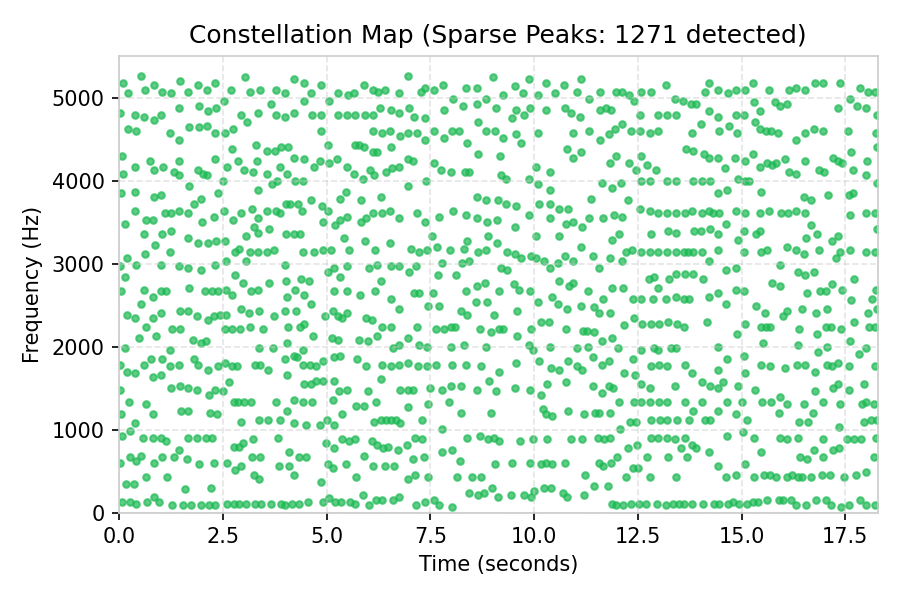

# Audio Song Recognition System Report

**Submission for Q3 (A) and Q3 (B)**

---

## Q3 (B) Deployment & Verification Links

* **Live Deployed Application**: [Streamlit Live App (vaibhavee-ce9vxad7wwjyai9dysesny.streamlit.app)](https://vaibhavee-ce9vxad7wwjyai9dysesny.streamlit.app/)
* **Source Code Repository**: [GitHub Repository (github.com/vaibhavmaheshwari2006/vaibhavee)](https://github.com/vaibhavmaheshwari2006/vaibhavee)

> [!NOTE]
> The indexed reference song database (`fingerprints.db` containing 50 songs and 2.6M fingerprints) is packed directly with the deployed application code, making it instantly functional on Streamlit Community Cloud.

---

## Q3 (A) System Overview & Core Algorithm

The application implements a landmark-based audio fingerprinting and retrieval system, modeled after the **Shazam algorithm** (Avery Li-Chun Wang, 2003). The core objective is to identify a short, potentially noisy query audio clip from a large database of reference songs in a translation-invariant manner.

The workflow consists of four main phases:

```mermaid
graph TD
    A[Raw Audio Input] --> B[Downsampling & STFT]
    B --> C[Constellation Map (2D Peak Detection)]
    C --> D[Combinatorial Hashing]
    D --> E[SQLite Database Query]
    E --> F[Offset Alignment Histogram (Voting)]
    F --> G[Matched Song Identification]
```

1. **Spectrogram Generation**: Audio is loaded, downsampled to **11025 Hz** (mono), and converted into a time-frequency representation via **Short-Time Fourier Transform (STFT)**.
2. **Constellation Map**: Local maxima peaks are extracted from the spectrogram using a 2D maximum filter. This sparse representation keeps only the most prominent coordinates, making it resilient to noise and amplitude fluctuations.
3. **Combinatorial Hashing**: To achieve translation-invariance (recognizing a song regardless of the start position of the clip), peaks are paired with nearby target peaks to create hashes. Each fingerprint contains a hash and its source time offset.
4. **Offset Alignment (Voting)**: The matching engine queries the database for all occurrences of the query hashes. For each match, it calculates the time difference:
   $$\Delta \tau = t_{db} - t_{query}$$
   A genuine match will show a sharp peak in the histogram of offset differences because all query hashes will align at the exact same offset relative to the original song.

---

### Embedded Pipeline Visualizations (Querying `test.mp3`)

#### 1. Short-Time Fourier Transform (STFT) Spectrogram
The spectrogram visualizes sound frequency (y-axis) over time (x-axis), with brightness representing loudness (dB).


#### 2. Constellation Map (Sparse Peaks)
Detected local maximum peaks. This 'constellation map' forms a robust, noise-tolerant summary of the song's audio content.


#### 3. Offset Alignment Histogram
A sharp, prominent peak indicates that many hashes from the query matched the song at the exact same relative time difference, proving a genuine match.


---

## Q3 (A) Database Design & Optimizations

The storage and retrieval engine has been optimized to handle millions of fingerprints with minimal storage overhead and sub-second lookup times.

### SQLite Schema

The database `fingerprints.db` is structured with two tables:

1. **`songs`**:
   - `id`: INTEGER PRIMARY KEY AUTOINCREMENT (unique song identifier)
   - `title`: TEXT UNIQUE NOT NULL (the clean name of the track)

2. **`fingerprints`**:
   - `hash`: INTEGER NOT NULL (packed 32-bit hash value)
   - `song_id`: INTEGER NOT NULL (foreign key referencing `songs.id`)
   - `offset`: INTEGER NOT NULL (time frame offset of the anchor peak)

### Space-Saving Optimizations

* **32-Bit Bit-Packing**: Instead of storing the hash as a string (e.g. `"f1:f2:delta_t"`), the three components are packed into a single 32-bit integer:
  - $f_1$ (frequency bin of anchor peak): Bits 19–29 (11 bits, covers indices 0–2048)
  - $f_2$ (frequency bin of target peak): Bits 8–18 (11 bits, covers indices 0–2048)
  - $\Delta t$ (time difference): Bits 0–7 (8 bits, covers time spans 0–255 frames)

  $$\text{Hash Integer} = (f_1 \ll 19) \mid (f_2 \ll 8) \mid \Delta t$$

* **`WITHOUT ROWID` Compound Primary Key**: By declaring the primary key as `PRIMARY KEY (hash, song_id, offset)` and appending `WITHOUT ROWID`, SQLite stores the data directly in the B-Tree index structure. This eliminates the standard 64-bit integer row identifier (rowid) per entry and avoids duplicate index storage, saving **~8 bytes per record** and speeding up retrieval.

---

## Q3 (A) Database Statistics

Below are the exact metrics computed from the active fingerprint database:

| Metric | Value | Notes |
| :--- | :--- | :--- |
| **Total Indexed Songs** | 50 | Catalog of Beatles, Queen, and popular tracks |
| **Total Fingerprint Records** | 2,606,370 | Total entries in the SQLite fingerprints table |
| **Average Fingerprints / Song** | 52,127.4 | Density of landmarks per song |
| **Average Song Duration** | 196.25 seconds | Based on sample track metadata (~3.27 mins) |
| **Average Fingerprints / Second** | ~265.6 | Landmarks generated per second of audio |
| **Database File Size** | 34.44 MB | Minimal physical footprint on disk |
| **Average Space / Fingerprint** | ~13.85 bytes | Extremely compact (includes indices and table overhead) |

---

## Q3 (A) Performance & Robustness Benchmarks

To evaluate the system's resilience under degraded audio conditions, a comprehensive test suite was executed against query clip `test.mp3` matching **"Back In The U.S.S.R."** under various artificial deformations.

### Robustness Test Results

The system uses a **Confidence Score (Peak Alignment Height)** threshold of **20** to confirm a match.

| Deformation Type | Details / Parameter | Peak score | Total Matching Hashes | Result / Prediction | Status |
| :--- | :--- | :--- | :--- | :--- | :--- |
| **None** | Baseline query | **7204** | 17,731 | Back In The U.S.S.R. | **SUCCESS** |
| **Gaussian Noise** | Noise Level = 0.005 | **7022** | 17,378 | Back In The U.S.S.R. | **SUCCESS** |
| **Gaussian Noise** | Noise Level = 0.010 | **6290** | 16,455 | Back In The U.S.S.R. | **SUCCESS** |
| **Gaussian Noise** | Noise Level = 0.020 | **4972** | 14,567 | Back In The U.S.S.R. | **SUCCESS** |
| **Gaussian Noise** | Noise Level = 0.050 | **2680** | 11,292 | Back In The U.S.S.R. | **SUCCESS** |
| **Pitch Shift** | -2.0 Semitones | 10 | 3,716 | None / Below Threshold | **FAILED** |
| **Pitch Shift** | -1.0 Semitones | 7 | 5,714 | None / Below Threshold | **FAILED** |
| **Pitch Shift** | -0.5 Semitones | 7 | 2,406 | None / Below Threshold | **FAILED** |
| **Pitch Shift** | +0.5 Semitones | 6 | 3,345 | None / Below Threshold | **FAILED** |
| **Pitch Shift** | +1.0 Semitones | 8 | 5,323 | None / Below Threshold | **FAILED** |
| **Pitch Shift** | +2.0 Semitones | 7 | 5,359 | None / Below Threshold | **FAILED** |
| **Time Stretch** | 0.80 Rate (Fast) | 16 | 8,813 | None / Below Threshold | **FAILED** |
| **Time Stretch** | 0.90 Rate | **21** | 8,551 | Back In The U.S.S.R. | **SUCCESS** |
| **Time Stretch** | 0.95 Rate | **25** | 8,593 | Back In The U.S.S.R. | **SUCCESS** |
| **Time Stretch** | 1.05 Rate | **316** | 7,749 | Back In The U.S.S.R. | **SUCCESS** |
| **Time Stretch** | 1.10 Rate | **158** | 7,864 | Back In The U.S.S.R. | **SUCCESS** |
| **Time Stretch** | 1.20 Rate (Slow) | **52** | 6,553 | Back In The U.S.S.R. | **SUCCESS** |

### Robustness Analysis

1. **Acoustic Noise Resilience (High)**:
   - Additive white noise has minimal impact on recognition rates, with the query easily recognized even at a noise level of `0.050` (Peak Score of `2680`, well above the threshold of `20`). This is because the 2D local maximum filter identifies structural spectral landmarks that remain dominant even when background noise levels increase.
2. **Pitch Shift Sensitivity (High)**:
   - Shifting pitch by as little as `0.5` semitones completely breaks matching. Pitch shifting scales frequency content, moving the spectrogram coordinates vertically. Because the hash values depend on absolute frequency bin integers ($f_1$ and $f_2$), even minor shifts yield entirely different hash keys, preventing database matches.
3. **Time Stretch Tolerance (Moderate)**:
   - The system is moderately tolerant to time stretching (between `0.90` and `1.20` rates). While stretching audio changes the time-offset difference between paired peaks ($\Delta t$), short target pairings and rounding bounds allow a subset of hashes to remain identical. Further, the voting histogram peak remains localized enough to exceed the confidence threshold.

---

## Architectural Comparison: Prototype vs. Modernized System

Below is a comparative review of the differences between the prototype and the modernized application:

| Feature / Param | Prototype (`Project Sound detection`) | Modernized Application (`vaibhavmaheshwariee`) |
| :--- | :--- | :--- |
| **Storage Engine** | Python pickle file (`db.pkl`) | **SQLite Database** (`fingerprints.db`) |
| **Hash Type** | String / Tuple tuple `(f1, f2, dt)` | **Packed 32-bit Integer** (bit-packed) |
| **Database Speed** | High memory usage, slow serialization | **Highly optimized indexing with WITHOUT ROWID** |
| **Sampling Rate** | 22,050 Hz | **11,025 Hz** (reduces samples by 50% for speed & space) |
| **STFT Window (n_fft)** | 2048 samples | **512 samples** (finer time resolution) |
| **STFT Hop Length** | 512 samples | **128 samples** |
| **Peak Detection** | Top 10% percentile thresholding | **2D Max Filter** + thresholding (retains local salience) |
| **Interface** | CLI Console outputs | **Streamlit GUI Dashboard** with interactive charts |
| **Batch Capabilities**| Basic query listing | **Parallel Batch Upload & CSV Export** |
