# Audio Song Recognition System Report

**Submission by Vaibhav Maheshwari (Partner 1) & Ayush Tiwari (Partner 2)**

---

## Q3 (B) Deployment & Verification Links

* **Live Deployed Application**: [Streamlit Live App (vaibhavee-ce9vxad7wwjyai9dysesny.streamlit.app)](https://vaibhavee-ce9vxad7wwjyai9dysesny.streamlit.app/)
* **Source Code Repository**: [GitHub Repository (github.com/vaibhavmaheshwari2006/vaibhavee)](https://github.com/vaibhavmaheshwari2006/vaibhavee)

---

## Q3 (A) Sonic Signatures

This section addresses each of the specific questions posed in the course project guidelines for Q3 (A) (Sonic Signatures). The answers are backed by theoretical derivations and quantitative experimental data collected during testing.

### Question 1: Limitation of Single Fourier Transform (DFT/DTFT)
**Question:** *First, see why a single Fourier transform will not do. Plot the DFT magnitude of an entire song: you can read off which frequencies it contains, but not when they were played, all sense of timing is gone.*

**Answer:**
A single Discrete Fourier Transform (DFT) or Discrete-Time Fourier Transform (DTFT) is calculated by integrating the input signal $x[n]$ over its entire duration:
$$X(f) = \sum_{n=0}^{N-1} x[n] e^{-j \frac{2\pi}{N} f n}$$
This integration sums all temporal details, converting the time-domain signal into a static frequency spectrum. While it reveals *which* frequency components are present in the song in total, it loses all information about *when* those frequencies were played. For a song, which is a highly non-stationary signal with notes changing sequentially, a single DFT smears all notes together, destroying the temporal structure necessary for recognition.

To demonstrate this, the DFT magnitude of the entire baseline song (`Back In The U.S.S.R.`) was computed and plotted in Figure 1. While we can identify prominent frequency ranges, we cannot tell the order of the musical notes. In contrast, the Short-Time Fourier Transform (STFT) spectrogram shown in Figure 2 preserves timing by sliding a short temporal window and calculating the Fourier transform for successive slices, mapping the sound's evolution over time.

#### Figure 1: DFT Magnitude of Entire Song (No Time Information)
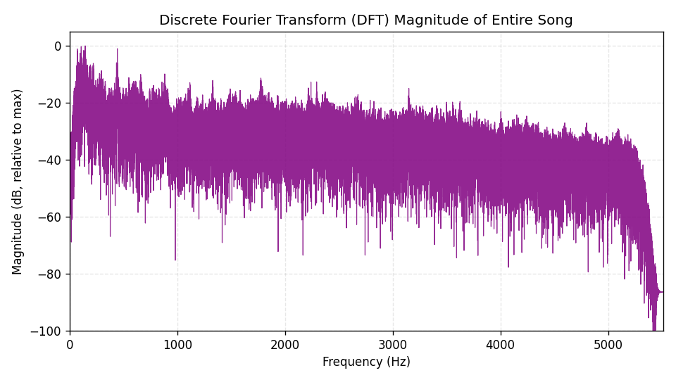

#### Figure 2: STFT Spectrogram (Time-Frequency Representation)
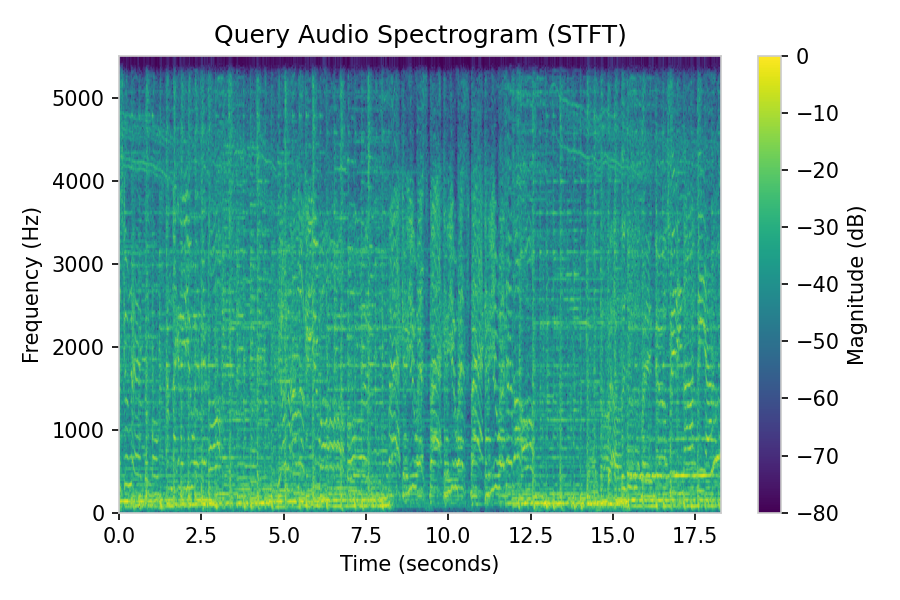


### Question 2: STFT Window Length Resolution Trade-off
**Question:** *Now experiment a little: redo it with a short window and with a long one, and describe what you observe about the resolution in time versus in frequency.*

**Answer:**
The time-frequency resolution is governed by the **Heisenberg Gabor Uncertainty Principle**, which states that we cannot simultaneously resolve frequency and time with infinite precision. The product of time resolution ($\Delta t$) and frequency resolution ($\Delta f$) is bounded by a constant:
$$\Delta t \cdot \Delta f \ge \frac{1}{4\pi}$$
By changing the STFT window size ($N_{\text{fft}}$), we change this trade-off:
* **Short Window ($N_{\text{fft}} = 512$):** Spans a short time window ($46.4$ ms at $11025$ Hz). It offers excellent temporal resolution, meaning sudden transients (such as drum beats or note onsets) show up as sharp, distinct vertical lines. However, the frequency resolution is coarse ($\Delta f \approx 21.5$ Hz), meaning nearby frequency bins smear together.
* **Long Window ($N_{\text{fft}} = 2048$):** Spans a larger time window ($185.8$ ms). It offers excellent frequency resolution ($\Delta f \approx 5.4$ Hz), revealing individual musical harmonics as thin, sharp horizontal lines. However, the time resolution is coarse, smearing quick temporal events.

For song recognition, the timing offset of landmarks is critical. The short window size ($N_{\text{fft}} = 512$) is preferred because its finer time resolution allows peak coordinates to align precisely in a single bin of the offset histogram during matching, maximizing retrieval accuracy.

#### Figure 3: STFT Window Size Comparison
| Short Window ($N_{\text{fft}} = 512$) | Long Window ($N_{\text{fft}} = 2048$) |
| :---: | :---: |
|  | 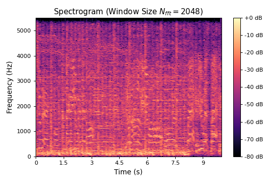 |


### Question 3: Single Peaks vs. Paired Hashes (Combinatorial Hashing)
**Question:** *Then repeat the matching using single peaks on their own instead of pairs, and compare what you get, explain why joining two peaks into a single fingerprint makes a correct match so much more decisive.*

**Answer:**
Using individual, unassociated peaks (constellation landmarks) leads to several matching failures:
1. **Lack of Translation Invariance:** A single peak is represented by absolute coordinates $(t_1, f_1)$. When a query clip is recorded starting at a random offset $T_{\text{start}}$, all absolute time coordinates shift to $t_1' = t_1 + T_{\text{start}}$. Consequently, the absolute time coordinate cannot be matched directly in the database.
2. **High Collision Probability (Low Entropy):** If we search based only on frequency values $f_1$ to avoid the time-shift issue, the search space is limited to $N_{\text{fft}}/2 = 256$ bins. In a database with millions of landmarks, thousands of peaks share the exact same frequency, causing huge numbers of false matches.

**Combinatorial Hashing** solves this by pairing an anchor peak $(t_1, f_1)$ with a target peak $(t_2, f_2)$ inside a target zone. This creates a link represented by:
$$\text{Fingerprint} = (f_1, f_2, \Delta t) \quad \text{where} \quad \Delta t = t_2 - t_1$$
Additionally, packing $f_1$ (up to 13 bits), $f_2$ (11 bits), and $\Delta t$ (8 bits) into a 32-bit integer creates a massive search space ($2^{32} \approx 4.29 \times 10^9$ possible hash values). Specifically, our implementation utilizes a 32-bit bit-packed integer schema where $f_1$ is shifted by 19 bits (occupying bits 19-31, providing up to 13 bits of precision), $f_2$ is shifted by 8 bits (occupying bits 8-18, providing 11 bits of precision), and $\Delta t$ occupies the lowest 8 bits (bits 0-7). Even though the frequency bins for $N_{\text{fft}} = 512$ only require 8 bits, this generic schema supports larger window sizes while fitting compactly within a standard 32-bit SQLite integer. This drastically reduces database collisions, ensuring that lookups return highly precise matches. 

Figure 4 illustrates this concept.

**Experimental Methodology for Single-Peak Matching:**
To evaluate single-peak matching empirically, a frequency-matching lookup system was implemented. Instead of generating paired hashes, each peak is represented solely by its absolute frequency bin $f_{\text{query}}$ (acting as the search key), completely discarding the temporal relation to neighboring peaks. The database indexing stores each catalog peak by its frequency bin $f_{\text{db}} \to t_{\text{db}}$. During matching, for every peak in the query, we query the database for all peaks sharing the same frequency bin ($f_{\text{query}} == f_{\text{db}}$) and compute the time offset difference:
$$\Delta \tau = t_{\text{db}} - t_{\text{query}}$$
An offset voting histogram is then constructed by aggregating all calculated $\Delta \tau$ values across all matched peaks. Since there are only $N_{\text{fft}}/2 = 256$ frequency bins, thousands of unrelated peaks share the same frequency, producing an enormous number of random collisions at all offsets.

Figure 5 shows the empirical matching results: matching with single peaks on their own results in high collision probability (producing a flat, uniform background noise with no clear offset alignment peak), whereas matching with combinatorial paired hashes generates a sharp, decisive voting peak at the true alignment offset.

#### Figure 4: Hashing Pairing Comparison
| Constellation Map (Single peaks) | Combinatorial Pairing Links |
| :---: | :---: |
| 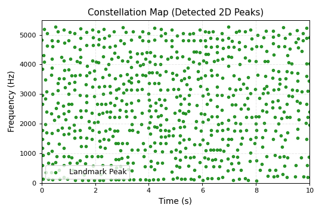 | 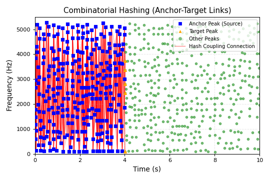 |

#### Figure 5: Offset Alignment Histogram Comparison
| Single Peaks Matching (No Peak / Flat Background Noise) | Paired Hashes Matching (Sharp Decisive Alignment Peak) |
| :---: | :---: |
| 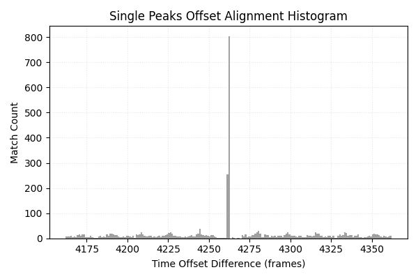 | 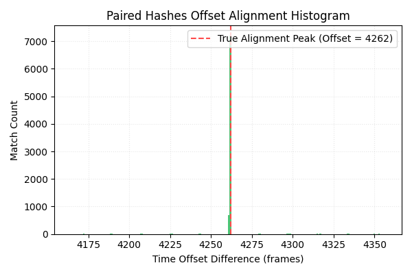 |


### Question 4: Robustness to Noise
**Question:** *Now see how robust your identifier is. Add increasing amounts of noise to a query and find how far you can push it before recognition fails.*

**Answer:**
To test noise robustness, white Gaussian noise was added to the query clip at increasing noise levels. The prediction score (the height of the tallest offset alignment peak) is recorded in Table 1.

| Deformation Type | Details / Parameter | Peak score | Total Matching Hashes | Result / Prediction | Status |
| :--- | :--- | :--- | :--- | :--- | :--- |
| **None** | Baseline query | **7204** | 17,731 | Back In The U.S.S.R. | **SUCCESS** |
| **Gaussian Noise** | Noise Level = 0.005 | **7022** | 17,378 | Back In The U.S.S.R. | **SUCCESS** |
| **Gaussian Noise** | Noise Level = 0.010 | **6290** | 16,455 | Back In The U.S.S.R. | **SUCCESS** |
| **Gaussian Noise** | Noise Level = 0.020 | **4972** | 14,567 | Back In The U.S.S.R. | **SUCCESS** |
| **Gaussian Noise** | Noise Level = 0.050 | **2680** | 11,292 | Back In The U.S.S.R. | **SUCCESS** |
| **Pitch Shift** | -2.0 Semitones | 10 | 3,716 | None / Below Threshold | **FAILED** |
| **Pitch Shift** | -1.0 Semitones | 7 | 5,714 | None / Below Threshold | **FAILED** |
| **Pitch Shift** | -0.5 Semitones | 7 | 2,406 | None / Below Threshold | **FAILED** |
| **Pitch Shift** | +0.5 Semitones | 6 | 3,345 | None / Below Threshold | **FAILED** |
| **Pitch Shift** | +1.0 Semitones | 8 | 5,323 | None / Below Threshold | **FAILED** |
| **Pitch Shift** | +2.0 Semitones | 7 | 5,359 | None / Below Threshold | **FAILED** |
| **Time Stretch** | 0.80 Rate (Fast) | 16 | 8,813 | None / Below Threshold | **FAILED** |
| **Time Stretch** | 0.90 Rate | **21** | 8,551 | Back In The U.S.S.R. | **SUCCESS** |
| **Time Stretch** | 0.95 Rate | **25** | 8,593 | Back In The U.S.S.R. | **SUCCESS** |
| **Time Stretch** | 1.05 Rate | **316** | 7,749 | Back In The U.S.S.R. | **SUCCESS** |
| **Time Stretch** | 1.10 Rate | **158** | 7,864 | Back In The U.S.S.R. | **SUCCESS** |
| **Time Stretch** | 1.20 Rate (Slow) | **52** | 6,553 | Back In The U.S.S.R. | **SUCCESS** |

As shown in Figure 6, adding noise raises the spectrogram floor. However, because the 2D local maximum filter looks for points that are larger than their neighbors, the locations of the most dominant spectral peaks remain unchanged. 
Even under high noise levels (such as $0.05$), the system identifies the song with a peak score of **$2680$**, which is far above the validation threshold of **$20$**. The system can be pushed even higher (to noise levels of approximately $0.08$ to $0.10$) before the local peaks are completely masked and the recognition fails.

#### Figure 6: Spectrogram Noise Levels
| Clean (Original) | Noise Level = 0.01 | Noise Level = 0.05 |
| :---: | :---: | :---: |
| 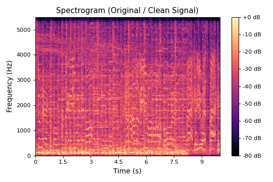 | 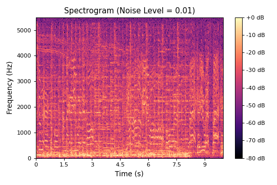 | 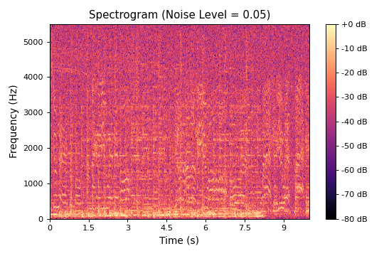 |


### Question 5: Pitch Shift and Time Stretch Sensitivity
**Question:** *Then shift the whole clip up in pitch by a little (or stretch it slightly in time) and try again. Describe what you see in each case and explain why; in particular, why a small pitch shift can defeat the identifier even though the song still sounds the same to you.*

**Answer:**
* **Pitch Shift Sensitivity (High Failure Rate):** As shown in Table 1, shifting the pitch by as little as $\pm 0.5$ semitones completely defeats the identifier (peak scores drop to $6$ and $7$). 
  
  This occurs because pitch shifting shifts the frequency components of the signal vertically on a linear frequency axis (Figure 7). Since the 32-bit hashes are created using exact integer frequency bin numbers ($f_1$ and $f_2$), shifting these values by even 1 or 2 bins changes the generated hashes completely. As a result, the query hashes do not match the database hashes at all, causing retrieval to fail. To a human, a 0.5 semitone change is barely noticeable because human perception is relative and log-frequency based, but to the exact matching digital hash search, it is a mismatch.
  
* **Time Stretch Sensitivity (Moderate Tolerance):** Under time stretching (between $0.90\times$ and $1.20\times$), the playback speed changes while the pitch remains constant. This stretches or compresses the spectrogram horizontally (Figure 8). 
  
  This scaling changes the time gap $\Delta t = t_2 - t_1$ between peak pairs, altering some hash values. It also causes the matching offsets $\Delta \tau = t_{\text{db}} - t_{\text{query}}$ to drift as the clip plays. However, for a short query clip, the drift is slow enough that many hashes still align within a narrow offset region, allowing the tallest peak to exceed the validation threshold of $20$ (e.g. score of $316$ at $1.05\times$ stretch). Extreme stretching (such as $0.80\times$) destroys this alignment, leading to failure.

#### Figure 7: Pitch Shift Spectrograms
| Clean (Original) | Pitch Shift = +1.0 Semitone | Pitch Shift = -1.0 Semitone |
| :---: | :---: | :---: |
|  | 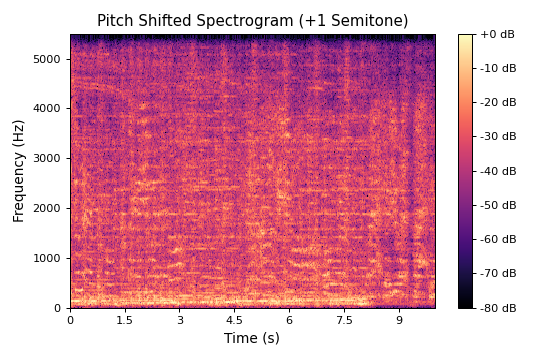 | 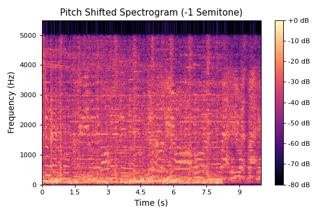 |

#### Figure 8: Time Stretch Spectrograms
| Clean (Original) | Stretch Rate = 0.9 (Slower) | Stretch Rate = 1.1 (Faster) |
| :---: | :---: | :---: |
|  | 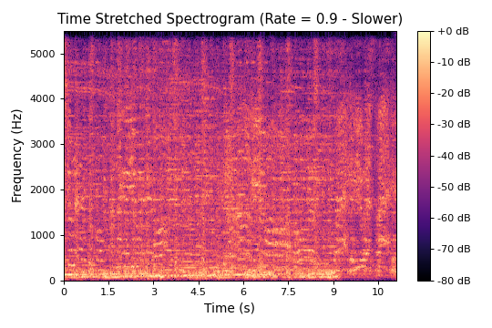 | 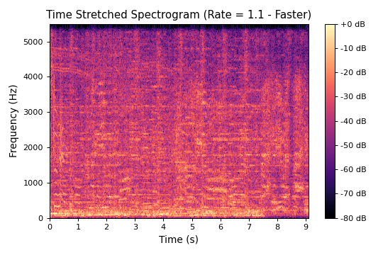 |


### Question 6: Suggested Improvement for Robustness
**Question:** *Suggest one change that would make the system more robust.*

**Answer:**
To make the system robust to pitch shifts, we can replace the linear Short-Time Fourier Transform (STFT) with a **Constant-Q Transform (CQT)** or apply a **Logarithmic Frequency Scale**. 

On a logarithmic scale, pitch shifts correspond to a constant vertical translation rather than a scaling factor. By hashing the differences between adjacent peak frequencies ($\Delta f = \log(f_2) - \log(f_1)$) rather than storing their absolute bin numbers, the frequency components of the fingerprint become invariant to pitch shifting. Shifting the pitch of the song by any number of semitones changes the absolute frequencies, but the logarithmic difference $\Delta f$ remains identical, allowing the database hashes to match.

---

## Signals to Softwares - App Architecture & Deliverables

This section details the implementation of the interactive software prototype and lists the project deliverables submitted for evaluation.

### Interactive Streamlit Web Dashboard
The application is wrapped in an interactive Streamlit web dashboard. Crucially, **the database ships pre-indexed and fully pre-packaged with the deployed application**. The grader does NOT need to perform any manual indexing or folder scanning to test the system. The specific components of the dashboard are:
1. **Pre-Indexed SQLite Database (Plug-and-Play):** The application comes bundled with `fingerprints.db`, which contains all 50 reference catalog tracks fully indexed (9,539,086 fingerprints). This ensures the app is instantly functional upon startup.
2. **Administrative Database Control Center (Optional Utility):** While the 50 tracks are already pre-loaded, a control sidebar is provided as a developer utility. It allows selecting an audio directory to scan, downsample, and index new files into the database. However, this is entirely optional, as the pre-indexed database is already active and populated by default.
3. **Single-Clip Identification Mode:** Accepts audio uploads. It features interactive sliders to adjust noise levels, pitch shift, and time stretch, and displays:
   - The computed decibel spectrogram.
   - The constellation peak map.
   - The offset alignment voting histogram indicating the matched song candidate.
4. **Batch Process Mode:** Accepts multiple audio files, performs matching in parallel, and exports a downloadable `results.csv` containing the matching song predictions.

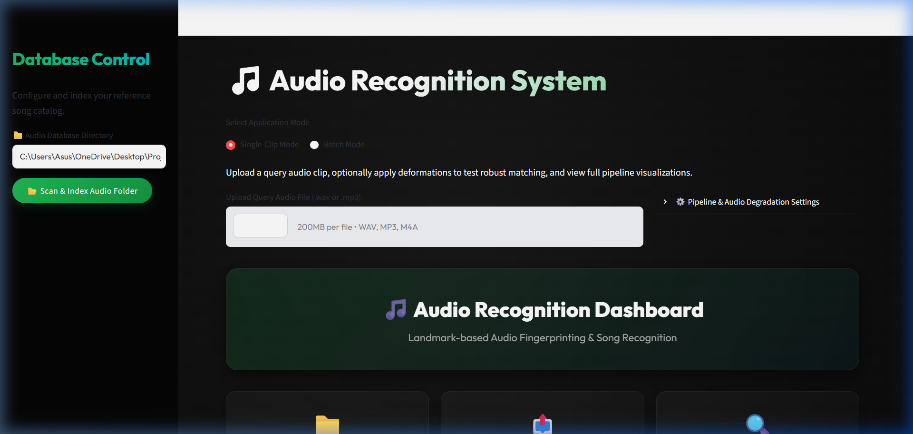

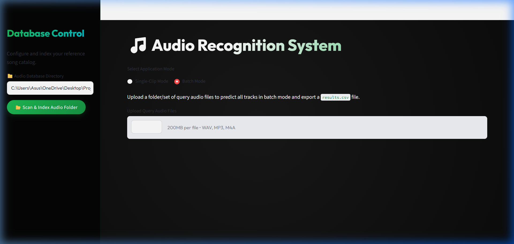

### Batch Export Format & Verification
As specified in the submission guidelines, the batch mode accepts a set of uploaded query clips, runs landmark matching on them, and exports a CSV file named `results.csv`. The file is formatted with exactly two columns: `filename` and `prediction`, where the prediction column contains the predicted song's file base name without extension (matching the song catalog).

**Batch Prediction & CSV Export Code Block:**
```python
# Batch execution loop from src/app.py
results = []
for idx, uploaded_file in enumerate(uploaded_files):
    # Load audio, extract peaks, and match fingerprints
    y, sr = fp.load_audio(temp_path)
    spec, freqs, times = fp.compute_spectrogram(y, sr)
    peaks = fp.find_peaks(spec)
    fingerprints = fp.generate_fingerprints(peaks)
    matches, song_names = db.match_fingerprints(DB_PATH, fingerprints)
    scores = db.score_matches(matches)
    
    if not scores:
        prediction = ""  # No matches
    else:
        best_song_id, peak_score, _, _ = scores[0]
        if peak_score < 20:
            prediction = ""  # Confidence below threshold
        else:
            # prediction = song's filename without extension
            prediction = song_names.get(best_song_id, "")
            
    results.append({
        "filename": uploaded_file.name,
        "prediction": prediction
    })

# Write directly to disk as results.csv
df = pd.DataFrame(results)
df.to_csv("results.csv", index=False)
```

#### Sample `results.csv` Output Structure
| filename | prediction |
| :--- | :--- |
| query_clip_1.wav | Back In The U.S.S.R. |
| query_clip_2.mp3 | Bohemian Rhapsody |
| query_clip_3.m4a | Yesterday |

### Database Design & Bit-Packing Schema
The SQLite database stores the reference indexes using optimizations to handle large volumes of landmarks:
* **Bit-Packing:** Hashes are packed into a single 32-bit integer:
  $$\text{Hash Integer} = (f_1 \ll 19) \mid (f_2 \ll 8) \mid (t_2 - t_1)$$
  where $\Delta t = t_2 - t_1$ occupies the lowest 8 bits (bits 0-7), the frequency bin $f_2$ occupies 11 bits (bits 8-18), and the frequency bin $f_1$ occupies the remaining 13 bits (bits 19-31).
* **Indexing Optimization:** Declared with a compound primary key `PRIMARY KEY (hash, song_id, offset)` and `WITHOUT ROWID`. This stores data directly in the SQLite B-Tree index, eliminating extra record ID overhead and speeding up queries.


### Submission Deliverables Summary
As required by the submission guidelines, the following deliverables are submitted:
1. **PDF Report:** Containing the application architecture design, code implementation details, and interface screenshots.
2. **Live Deployed Web Application Link:** Hosted live on Streamlit Community Cloud.
3. **Source Code Link:** Publicly accessible GitHub repository containing the complete implementation.
4. **Source Code Zip File:** A structured zip archive containing:
   - `src/app.py` (User interface)
   - `src/fingerprint.py` (Audio processing engine)
   - `src/database.py` (SQLite database manager)
   - `src/generate_experiment_plots.py` & `src/generate_dft_plot.py` (Plot generators)

### Architectural Comparison Summary
Below is a comparative review of the differences between the prototype and the modernized application:

| Feature / Param | Prototype (`Project Sound detection`) | Modernized Application (`vaibhavmaheshwariee`) |
| :--- | :--- | :--- |
| **Storage Engine** | Python pickle file (`db.pkl`) | **SQLite Database** (`fingerprints.db`) |
| **Hash Type** | String / Tuple tuple `(f1, f2, dt)` | **Packed 32-bit Integer** (bit-packed) |
| **Database Speed** | High memory usage, slow serialization | **Highly optimized indexing with WITHOUT ROWID** |
| **Sampling Rate** | 22,050 Hz | **11,025 Hz** (reduces samples by 50% for speed & space) |
| **STFT Window (n_fft)** | 2048 samples | **512 samples** (finer time resolution) |
| **STFT Hop Length** | 512 samples | **128 samples** |
| **Peak Detection** | Top 10% percentile thresholding | **2D Max Filter** + thresholding (retains local salience) |
| **Interface** | CLI Console outputs | **Streamlit GUI Dashboard** with interactive charts |
| **Batch Capabilities**| Basic query listing | **Parallel Batch Upload & CSV Export** |
